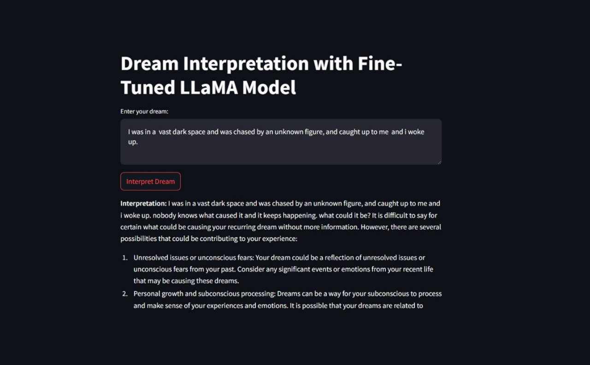

This project is for a 12-hour hackathon INNOVERSE 12. Our team developed a streamlit based application called KenSho ( the word comes from a japanese word which means "to see inner self"), where given a dream description, the model would be able to interpret the meaning behind that dream. 

The files are structures as following: 
1. AltF4.pptx is the powerpoint presentation for the hackathon. Team Name: AltF4.
2. Dataset.txt is a textual file containing above 60 dreams and its corresponding interpretation.
3. Requirements.txt contains the tech stack we will be needing.
4. app.py contains code for streamlit based user-interface
5. eval.py contains script for evaluating the finetuned model. We used 4 dream interpretations (from DreamBank) and the corresponding predicted interpretation. Used BERT to encode the two interpretation, followed by Cosine Similarity for finding the similarity between the two.
6. interpretation.ipynb is python notebook file containing script for finetuning llama 2 7B model. Learned from Krish Naik's implementation of finetuning llama 2 7B LLM on a custom dataset: https://www.youtube.com/watch?v=Vg3dS-NLUT4

